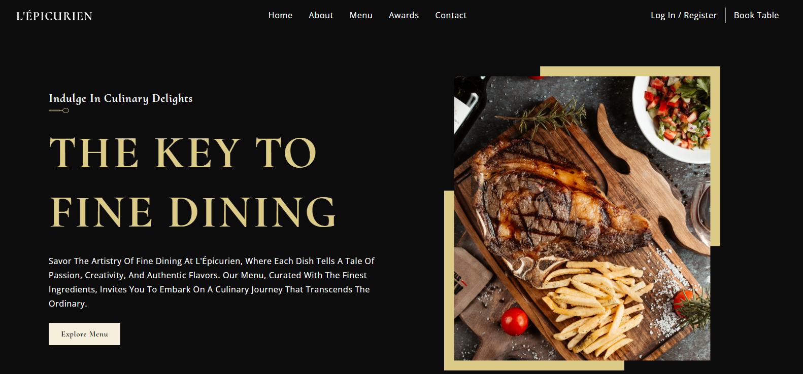

# L'Épicurien Restaurant 
Welcome to the L'Épicurien Restaurant Website Showcase, a static website project developed with React.js to highlight my front-end development skills.

## Live Demo

Explore the live demo [here](https://l-epicurean-restaurant.surge.sh/).

## Technologies Used
- React.js
- HTML5
- CSS3
- Node.js

## Features
- Clean and modern design
- Responsive layout for seamless viewing on various devices
- Integration of React.js for dynamic and interactive user experiences

Feel free to explore the website and navigate through its pages to get a glimpse of the L'Épicurien Restaurant Website. If you have any feedback or questions, don't hesitate to [contact me](mailto:shabdulmoiz96@gmail.com).

## How to Run Locally
1. Clone this repository: `git clone https://github.com/AbdulMoiz961/Static-Restaurant_Website.git`
2. Navigate to the project directory: `cd Static-Restaurant_Website`
3. Install dependencies: `npm install`
4. Start the development server: `npm start`

---

Happy Coding! 🚀
